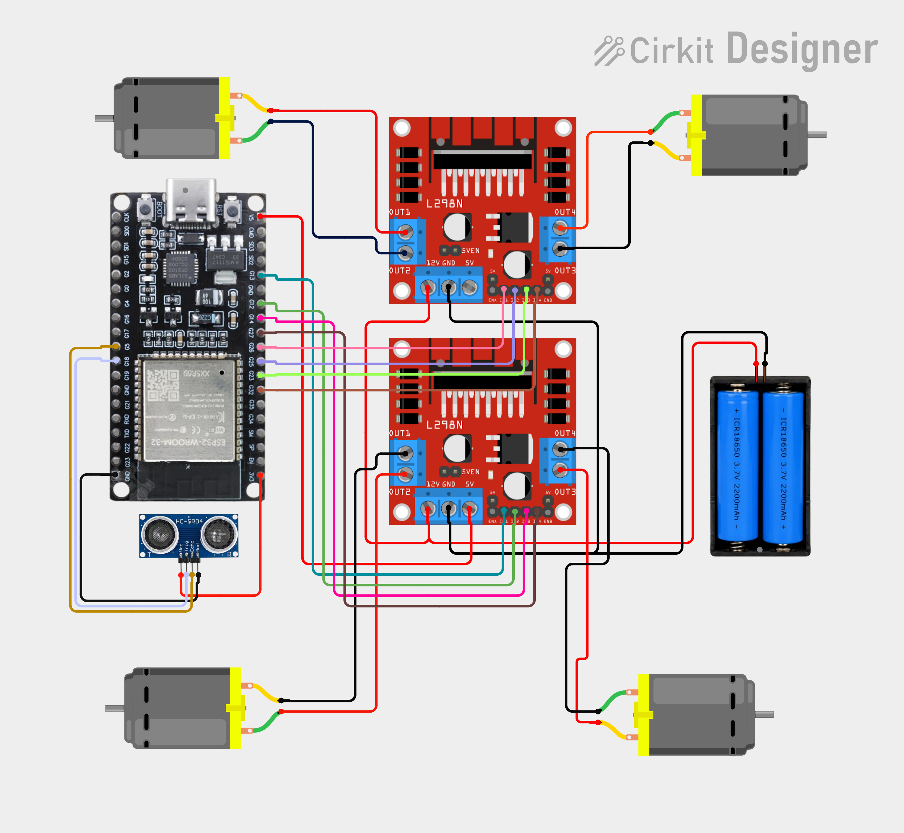

# Kylio Robot Car — ESP-IDF

Native ESP-IDF port of the Kylio Arduino firmware. It provides mecanum motor
control, HC-SR04 distance measurement, manual web control, obstacle avoidance,
follow mode, room monitoring, and Telegram notifications/settings.

## Wiring diagram



## Configure local secrets

Create the local configuration file once:

```powershell
Copy-Item .\main\secrets.example.h .\main\secrets.local.h
```

Edit `main/secrets.local.h` and set:

- one or more Wi-Fi SSID/password pairs;
- a newly generated Telegram bot token and its allowed chat ID;
- a strong username/password for the web dashboard.

`secrets.local.h` is ignored by Git. Do not reuse the Telegram token contained
in the imported Arduino archive; rotate it with BotFather first.

## One-time ESP-IDF tool setup

Run this once before the first build. It creates the ESP-IDF-specific Python
environment under `C:\Users\ASUS\.espressif` and downloads the required
Espressif tools. An Internet connection is required.

```powershell
& 'C:\Espressif\tools\python\v6.1\venv\Scripts\python.exe' 'C:\esp\v6.1\esp-idf\tools\idf_tools.py' install
```

The commands below put the Espressif Python first for the current PowerShell
window. This avoids a `python` command supplied by pyenv being used by
`export.ps1`.

```powershell
$env:Path = 'C:\Espressif\tools\python\v6.1\venv\Scripts;' + $env:Path
. 'C:\esp\v6.1\esp-idf\export.ps1'
idf.py --version
```

## Build

From the project directory, initialize ESP-IDF as shown above, then run:

```powershell
idf.py set-target esp32
idf.py build
```

The first build may also download the managed `espressif/cjson` dependency.
Its resolved version is recorded in `dependencies.lock`.

## Flash and monitor

Replace `COM5` with the serial port used by the board:

```powershell
idf.py -p COM6 flash monitor
```

Exit the monitor with `Ctrl+]`. After the station connects, the log prints the
dashboard address, for example `http://192.168.1.42`. The browser will request
the username and password configured in `secrets.local.h`.

## Safety behavior

- All motor GPIOs are driven LOW during startup.
- Manual controls send a heartbeat every 100 ms while held; the firmware stops
  the motors if that heartbeat disappears for 350 ms.
- HC-SR04 timeouts do not interrupt manual forward motion. The front brake
  stops manual forward only after three valid measurements below 25 cm;
  it releases after a valid reading of at least 32 cm.
- A missing/invalid ultrasonic reading stops follow and automatic obstacle
  motion.
- Changing mode or enabling/disabling Telegram immediately stops the motors.
